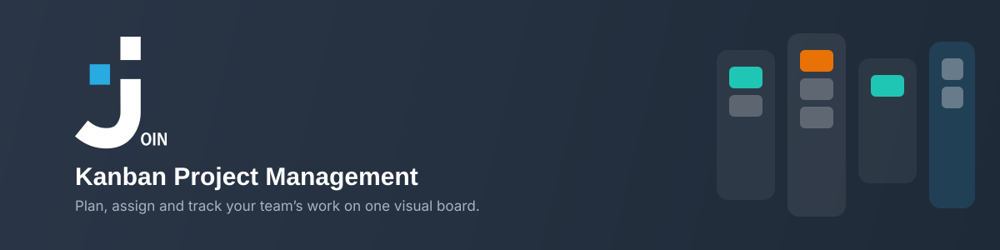
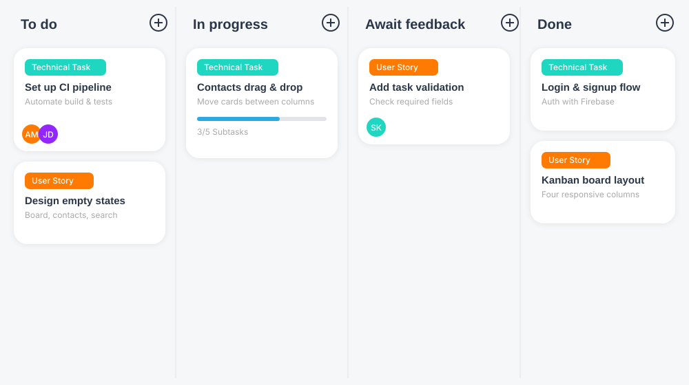

  

# 📋 Join – Kanban Board with an AI Issue Collector

**Join** is a kanban board for managing tasks and projects, built with plain
HTML, CSS and JavaScript (no build step, no npm). It was created by a group of
students during their web development bootcamp at the Developer Akademie.

On top of the board, Join runs an **AI issue collector**: stakeholders send a
plain e-mail to a dedicated mailbox, an AI reads the message, works out what kind
of request it is, how urgent it is and when it is due — and files it as a ticket
in the board's **Triage** column. The sender is recorded as the ticket's author
and is notified by e-mail when their ticket is created and whenever it moves to
another column. The automation runs in [n8n](https://n8n.io); the workflows are
checked into this repository under [`n8n/`](n8n/).

**Live demo:** <https://join.yannicjundt.de>

> ⚠️ **Important note:** Join is an educational exercise, not a production
> service. Availability, reliability and accuracy are not guaranteed. Tickets on
> the board are publicly visible, and e-mail texts are analysed by Google Gemini
> on its free tier — please use made-up data and don't send anything
> confidential.

---

## 🎬 Trying the demo

Everything below works with the live demo — no account and no local setup needed.

### 1️⃣ Look at the landing page

Open <https://join.yannicjundt.de>. It explains the process, names the mailbox to
write to, shows a sample e-mail next to everything the AI pulls out of it, and
states the daily limit.

### 2️⃣ Send a request by e-mail

Write to **join-issues@gmx.de** from your own mail program, in normal sentences —
no form and no fixed format. A message that exercises every field looks like
this:

> **Subject:** Login stopped working
>
> Hi, since this morning none of our staff can sign in. After entering the
> password nothing happens at all. This is blocking our whole production, we
> urgently need a fix by 05/09/2026.

Mention a date if you want to see a due date extracted, and use wording like
"urgently" or "blocking" to see the priority rise.

### 3️⃣ Watch the ticket appear

Within a minute or two you get a confirmation e-mail with the title, category,
priority and due date the AI derived. Then open the board — **Guest Log in** on
<https://join.yannicjundt.de/login.html> needs no account — and look at the
**Triage** column. Your ticket is there, marked as AI-generated, with your
address as its author and an **external** badge in the task detail view.

### 4️⃣ Move the ticket and get notified

Drag the ticket into another column. Within five minutes the author receives an
e-mail naming the ticket and the columns it moved between; moving it to **Done**
adds a thank-you.

### What else you can try

- **Send something that isn't a request** (an advert, an out-of-office reply):
  no ticket is created, and the mail is filed as handled.
- **Create a task manually** with *Add task*: manually created tasks also land in
  **Triage**, with the logged-in user as author and an **internal** badge.
- **Hit the daily limit:** after 10 e-mail-generated tickets in one day, further
  senders get a reply explaining the limit instead of a ticket.

---

## ⚙️ How the automation works

Two n8n workflows, exported to [`n8n/`](n8n/) and documented in
[`n8n/README.md`](n8n/README.md):

**`issue-collector.json` — e-mail ➜ ticket**

| Step | What happens |
|---|---|
| New e-mail | IMAP trigger on the inbox of the collector mailbox |
| Prepare mail | Extracts sender, subject, body and the message's IMAP UID |
| Daily limit | Counts today's AI tickets **before** the AI runs, so a rejected mail costs no AI quota |
| AI analysis | An Information Extractor with Google Gemini fills a fixed schema: is this a real request, title, category, priority, deadline, summary |
| Build ticket | Converts the result into a Join task, appends the "generated by AI" note, discards non-requests |
| Create in Triage | Writes the ticket into the Firebase Realtime Database |
| Reply | Confirmation, error notice or daily-limit notice to the sender |
| File the mail | Moves the message to the *erledigt* folder, or to *zu bearbeiten* if processing failed |

**`statusbenachrichtigung.json` — column change ➜ e-mail**

Every five minutes it compares the current tickets against the state it last saw
and mails the author of every ticket that changed column. n8n polls instead of
being called by the board, because the n8n instance is deliberately reachable
only from the home network.

### Safeguards worth knowing about

- **Daily limit of 10** e-mail-generated tickets, checked before the AI call —
  a cost airbag against a flooded mailbox.
- **No loop back to the mailbox:** every outgoing mail is suppressed if the
  recipient is the collector's own address, so a reply can never re-trigger the
  workflow.
- **First run is silent:** the notification workflow only records the starting
  state on its first run, instead of mailing every author at once.
- **Counting tickets, not events:** the daily total is derived from the tickets
  themselves, so an aborted run can't leave a counter out of step.

---

## 🗂️ Repository layout

| Path | Contents |
|---|---|
| `index.html` | Stakeholder landing page |
| `login.html` | Log in / sign up / guest access |
| `templates/` | Board, add task, contacts, summary, help, legal pages |
| `scripts/` | Frontend JavaScript, grouped by feature (`auth`, `board`, `tasks`, `contacts`) |
| `styles/` | CSS, grouped the same way |
| `assets/` | Fonts, icons, README images |
| `n8n/` | Exported n8n workflows + their documentation |
| `debug.log` | Plain-language change log, newest entry first |

Credentials live only inside n8n and Firebase — the exported workflows contain
credential IDs, never secrets.

---

## 🛠️ Running it yourself

**The board** is a static site: clone the repository and serve the folder with
any web server (`python3 -m http.server` is enough). The Firebase Realtime
Database URL is set in `script.js` (`DEFAULT_BASE_URL`); point it at your own
database to run with your own data.

**The automation** needs an n8n instance:

1. Import `n8n/issue-collector.json` and `n8n/statusbenachrichtigung.json`.
2. Create the credentials the workflows expect: IMAP and SMTP for the collector
   mailbox, and a Google Gemini (PaLM) API key.
3. Set the environment variables the code nodes read:
   `JOIN_MAIL_HOST`, `JOIN_MAIL_PORT`, `JOIN_MAIL_USER`, `JOIN_MAIL_PASSWORD`.
4. Create the folders `erledigt` and `zu bearbeiten` in the mailbox.
5. Point the HTTP nodes at your own Firebase database URL.
6. Allow the code nodes to use Node's `tls` module
   (`NODE_FUNCTION_ALLOW_BUILTIN=tls`) — n8n ships no node for moving a mail
   between IMAP folders, so the workflow speaks the protocol itself. Do **not**
   allow `fs`: file access would expose n8n's encryption key and with it every
   stored credential.

The free Gemini tier is quota-limited **per day and model**; the workflow uses
`gemini-3.5-flash-lite` and retries at most twice, because every attempt counts
against that quota.

---

## 📖 Using the board

### Exploring the board

The board has five columns:

- **Triage** – new and incoming tasks waiting to be prioritised
- **To do** – tasks that need to be completed
- **In progress** – tasks currently being worked on
- **Await feedback** – tasks waiting for feedback
- **Done** – completed tasks

  
   
  <em>Illustration of the board layout — not a live screenshot; it predates the Triage column.</em>

### Creating contacts

Go to **Contacts**, click **New contact** and fill in the details. Contacts can
then be assigned to tasks.

### Adding tasks

Click the **+** button on a column, or use **Add task**, and fill in title,
description, due date, priority, category, assignees and subtasks. Tasks created
this way start in **Triage**.

### Moving and deleting tasks

Drag a card from one column to another to reflect its current state. Open a card
to edit or delete it.

> ⚠️ **Caution:** Deleting a task removes it permanently. This cannot be undone.

---

## ❓ Questions?

Open an issue in this repository — or just send an e-mail to
**join-issues@gmx.de** and let the collector turn it into a ticket.

---

**Enjoy using Join!** 🎉
